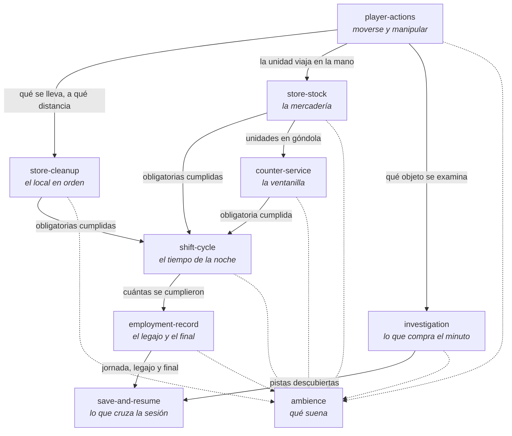

# Las capacidades y lo que pasa entre ellas

**El contrato de cada capacidad vive en su spec** —`specs/<capability>/<capability>.md`—. Este
documento no lo repite: declara **lo que pasa entre ellas**, que es lo único que ningún spec
puede decir solo.

Las reglas de edición de un spec están en [`.claude/rules/specs.md`](../../.claude/rules/specs.md),
y se cargan solas al tocar ese árbol.

## Una capacidad no es una capa

Una capacidad es una tajada de lo que el juego **hace**: atender la ventanilla, reponer la
góndola, arrastrar el legajo entre noches. Una capa es dónde vive el código que la implementa.
Son dos ejes distintos y se cruzan: casi toda capacidad tiene piezas en `dominio/` y en
`sistemas/`, y varias tienen una en `escenas/`.

Por eso el spec **no nombra archivos, clases ni escenas**: eso cambia con el refactor siguiente y
el contrato tiene que sobrevivirlo.

## El mapa

La línea punteada es la única relación que no es un dato: `ambience` **escucha** las señales de
las demás y no le contesta a nadie. Por eso su tabla es un archivo y no un `match`: agregar un
sonido no toca a quien lo emite.

## Las dos mitades de la resta

La tensión central del juego es aritmética, y en el mapa se lee de un vistazo: **`shift-cycle` es
la resta**, y las capacidades que le apuntan son lo que cada lado compra.

| Lado | Capacidades | Qué le hacen al turno |
|---|---|---|
| **Lo que el jefe pide** | `counter-service`, `store-stock`, `store-cleanup` | consumen tiempo **y** cumplen una obligatoria |
| **Lo que el jugador elige** | `investigation` | consume tiempo y **no cumple nada** |
| **El cuerpo** | `player-actions` | no consume por sí mismo: el precio son los metros |
| **Lo que dura más que la noche** | `employment-record`, `save-and-resume` | no consumen: reciben el cierre |

Al evaluar una feature, la pregunta es de qué lado cae. Una que no toca esa resta es contenido,
no diseño.

## Las fronteras que más se rompen

Tres pares se confunden seguido, y cada uno tiene su regla escrita en los dos specs:

- **`counter-service` y `store-stock`.** Cobrar es de la ventanilla; cuántas unidades hay y dónde
  están, de la mercadería. La ventanilla **pregunta**, no lleva su propia cuenta.
- **`player-actions` e `investigation`.** Agarrar y examinar son del cuerpo; **qué esconde** el
  objeto es de la investigación. La identidad de lo que se agarra es opaca a propósito: lo que se
  investiga no está en el catálogo.
- **`employment-record` y `save-and-resume`.** El legajo decide; el guardado sólo lo pone en
  disco y lo trae de vuelta.

## Dónde va una regla nueva

1. **¿Qué capacidad decide esto?** Si la respuesta es «dos», la regla está mal partida: una de
   las dos la consume.
2. **¿Se puede ejercer sin levantar una escena?** Si sí, el código va en `dominio/`. Si no, mirá
   otra vez — casi siempre se puede, y lo que no se puede es *dibujarla*.
3. **¿El GDD ya lo decidió?** Entonces el spec dice eso, aunque el código todavía diga otra cosa.
   Esa diferencia es el hallazgo, y sale en un issue.

Una capacidad nueva se abre sólo cuando la regla no entra en ninguna de las nueve **y** no es una
regla de una de ellas. Una capacidad de un solo criterio casi siempre es lo segundo.
